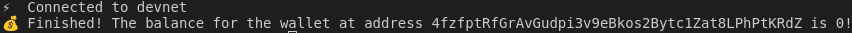
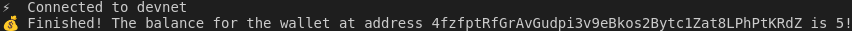
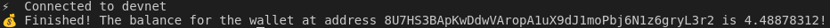

# Друга лабораторна робота

## Використання Solana Devnet

**Результат роботи програми `check-balance` при першому запуску:**

  

**Результат роботи програми `check-balance` після поповнення балансу:**

  

**Результат роботи програми `check-balance` для іншого гаманця:**

  

