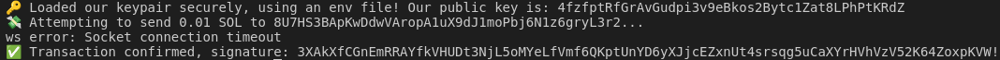
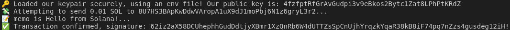

# Третя лабораторна робота

## Операції та відправлення SOL

**Результат роботи програми `send-sol` при першому запуску:**

  

**Результат роботи програми `send-sol` після додавання другої інструкції:**

  

