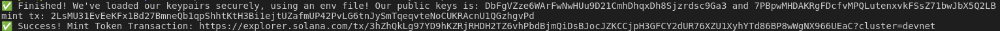

# Додаткові завдання до четвертої лабораторної роботи

## Multisig

**Результат роботи програми `create-multisig`:**

  

**Результат роботи програми `multisig-create-mint`:**

  

**Результат роботи програми `multisig-create-token-account`:**

  

**Результат роботи програми `multisig-mint-tokens`:**

  

## Переказ токена, але так, аби SOL за транзакцію оплатив би отримувач

**Результат роботи програми `transaction-by-recipient`:**

  

