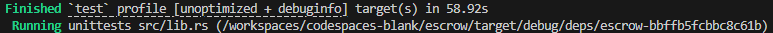

# Сьома лабораторна робота

## Anchor та токени

_Вихідний код цієї роботи можна знайти за [посиланням](https://github.com/DanyloM73/escrow)_ 

**Результати тестів після створення проекту:**

  

**Результати компіляції проекту:**

  

**Результати тестів написаної програми без тейкерів:**

  

**Результати тестів написаної повністю програми:**

  

